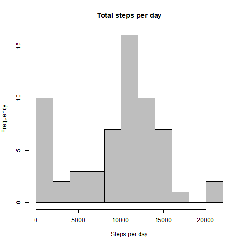
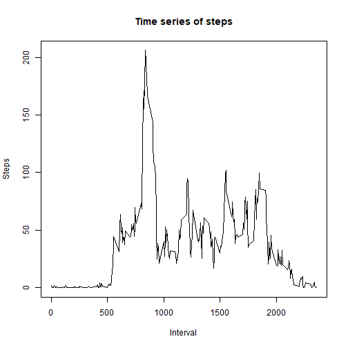
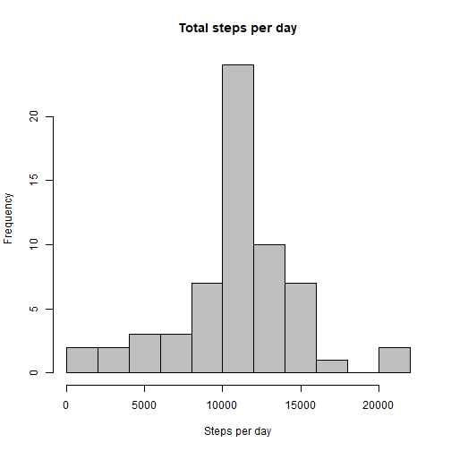
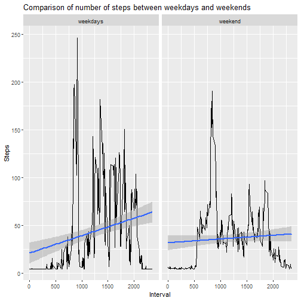

# Peer-graded Assignment: Course Project 1 : Reproducibility Research

### Hasitha Ranawaka, 11 October 2019

## Introduction

This assignment makes use of data from a personal activity monitoring device. This device collects data at 5 minute intervals through out the day. The data consists of two months of data from an anonymous individual collected during the months of October and November, 2012 and include the number of steps taken in 5 minute intervals each day.

With the above data set, a few analysis are performed to understand the nature of data.

## Loading and preprocessing the data

Loading relevant r packages

```r
library(ggplot2)
library(dplyr)
```

```
## 
## Attaching package: 'dplyr'
```

```
## The following objects are masked from 'package:stats':
## 
##     filter, lag
```

```
## The following objects are masked from 'package:base':
## 
##     intersect, setdiff, setequal, union
```

Loading Data

```r
filename <- "activity.zip"
# Checking whether the unziped files exist
if (!file.exists(filename)) {
        unzip(filename)
}

activity=read.csv("activity.csv")
```

## What is mean total number of steps taken per day?

#### Calculate the total number of steps taken per day

```r
steps_day <- tapply(activity$steps, activity$date, sum, na.rm=TRUE)
hist(steps_day, xlab = "Steps per day", ylab = "Frequency",
     breaks = 10, main = "Total steps per day",col = "grey")
```



#### Calculate and report the mean and median total number of steps taken per day

```r
mean_steps <- mean(steps_day)
median_steps <- median(steps_day)
```
* Mean: 9354.2295082
* Median:  10395

## What is the average daily activity pattern?

#### Make a time series plot of the 5-minute interval and the average number of steps taken, averaged across all days

```r
time_series=activity %>% group_by(interval) %>% summarise(steps=mean(steps, na.rm = TRUE))
plot(x=time_series$interval, y=time_series$steps, type = "l",
      main= "Time series of steps",
      xlab = "Interval",
      ylab = "Steps")
```



#### Which 5-minute interval, on average across all the days in the dataset, contains the maximum number of steps?


```r
maxsteps <- time_series[time_series$steps==max(time_series$steps),]$interval
```

* Maximum number of steps : 835

## Imputing missing values

##### Calculate and report the total number of missing values in the dataset


```r
count_na <- colSums(is.na(activity))
```
* Number of missing values : 2304 

##### Devise a strategy for filling in all of the missing values in the dataset.
##### Create a new dataset that is equal to the original dataset but with the missing data filled in.

```r
activity_imputed <- activity
activity_imputed$steps[is.na(activity_imputed$steps)==TRUE]=mean(activity$steps,na.rm = TRUE)
head(activity_imputed)
```

```
##     steps       date interval
## 1 37.3826 2012-10-01        0
## 2 37.3826 2012-10-01        5
## 3 37.3826 2012-10-01       10
## 4 37.3826 2012-10-01       15
## 5 37.3826 2012-10-01       20
## 6 37.3826 2012-10-01       25
```

##### Make a histogram of the total number of steps taken each day


```r
steps_day_2 =tapply(activity_imputed$steps, activity_imputed$date, sum)
hist(steps_day_2, xlab = "Steps per day", ylab = "Frequency",
     breaks = 10, main = "Total steps per day",col = "grey")
```



#### Calculate and report the mean and median total number of steps taken per day


```r
mean_steps_2 <- round(mean(steps_day_2),3)
median_steps_2 <- round(median(steps_day_2),3)
delta_mean  <- round((mean_steps_2-mean_steps)*100/mean_steps,3)
delta_median <- round((median_steps_2-median_steps)*100/median_steps,3)
```

* Mean    = 1.0766189 &times; 10<sup>4</sup>
* Median  = 1.0766189 &times; 10<sup>4</sup>
* Percentage change in mean   = 15.094%
* Percentage change in median = 3.571%

## Are there differences in activity patterns between weekdays and weekends?


```r
time_series_2 <- activity_imputed %>% 
        mutate(weekday=factor(as.POSIXlt(activity$date)$wday %in% c(0:5),
                              labels = c("weekdays","weekend"))) %>%
        group_by(interval,weekday) %>% summarise(steps=mean(steps))        
ggplot(data=time_series_2, aes(x=interval, y=steps))+
        geom_line()+
        geom_smooth(method = "lm")+
        facet_grid(.~weekday)+
        labs(title = "Comparison of number of steps between weekdays and weekends", 
             x= "Interval", y="Steps")
```



In weekends there is a slight drop of average number of steps.


